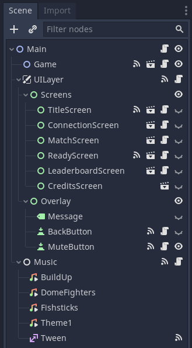
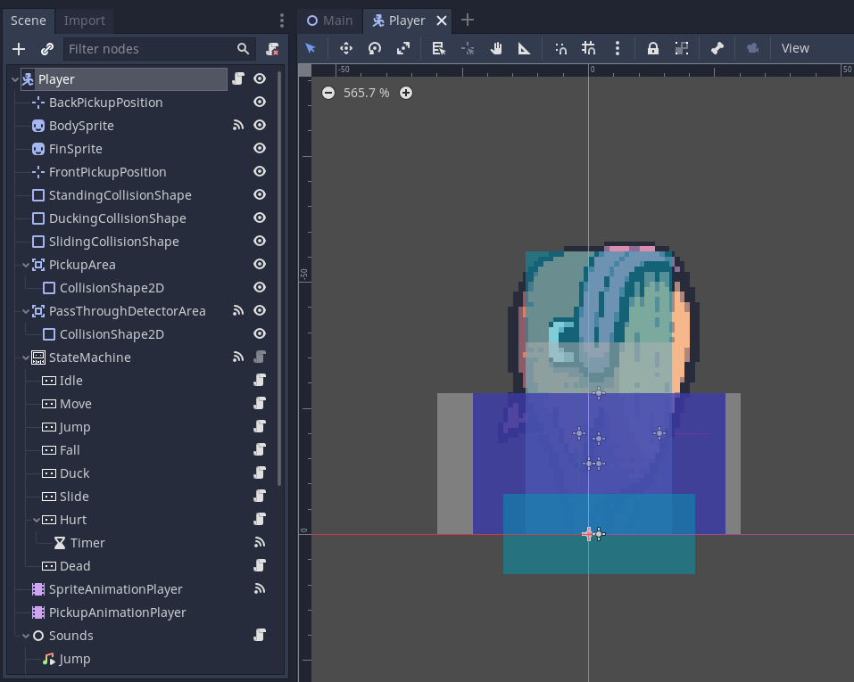
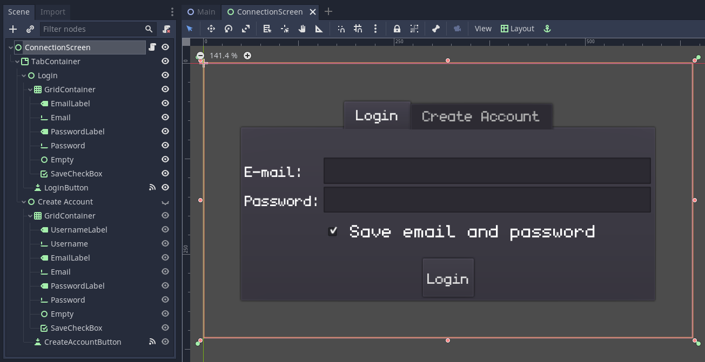
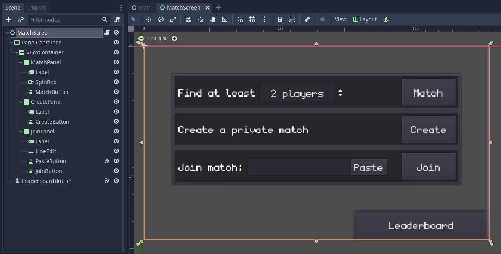
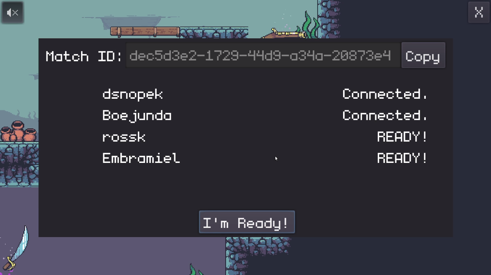
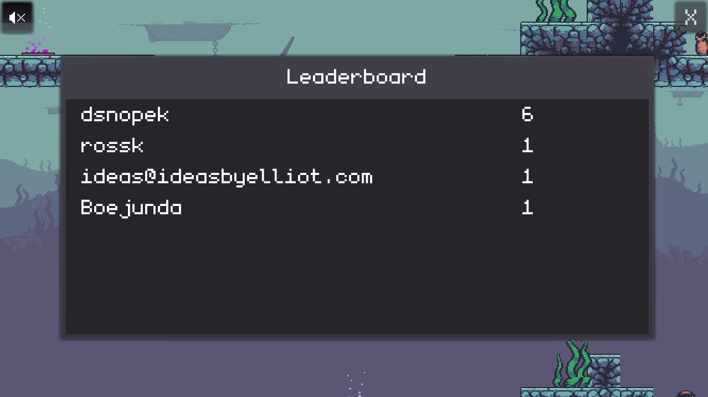

Fish Game: Making an online multiplayer game with Godot and Nakama
==================================================================

**["Fish Game" for Godot](https://github.com/heroiclabs/fishgame-godot)** is a
2-4 player online game built in the [Godot](https://godotengine.org/) game
engine, created as a demostration of [Nakama](https://heroiclabs.com/), an
open-source scalable game server.


As you can see, **"Fish Game"** is a frenetic battle royale starring murderous
fish - the last fish standing wins! The game design is heavily inspired by
[Duck Game](https://store.steampowered.com/app/312530/Duck_Game/) (except with
fish, rather than ducks ;-)).

If you want to try it out for yourself, you can download playable builds for
Windows, Linux or MacOS from the
[Releases page](https://github.com/heroiclabs/fishgame-godot/releases)
(see the controls
[here](https://github.com/heroiclabs/fishgame-godot#controls)).

In this tutorial, we're going to walk through each part of the code that
interacts with Nakama, in order to cover all the principles and APIs that
you need to know to create your own online multiplayer game with
Godot and Nakama.

In all, we'll touch on the following Nakama features:

- [User authentication](https://heroiclabs.com/docs/authentication/)
- [Matchmaking](https://heroiclabs.com/docs/gameplay-matchmaker/)
- [Realtime Multiplayer](https://heroiclabs.com/docs/gameplay-multiplayer-realtime/)
- [Leaderboards](https://heroiclabs.com/docs/gameplay-leaderboards/)

This tutorial assumes you're already proficient with game development in the
Godot game engine, but haven't ever used Nakama before.

Ready to start a fish fight? Let's go!

Playing the game from source
----------------------------

You can download the full source code from
[GitHub](https://github.com/heroiclabs/fishgame-godot). I recommend using the
[0.1.0 release](https://github.com/heroiclabs/fishgame-godot/releases/tag/v0.1.0),
because that's the version I'm looking at while writing this tutorial. Newer
versions of the game may exist by the time you read this, and the code in this
tutorial may not match.

In order to run the game from source, you'll need:

- [Godot](https://godotengine.org/download) 3.2.3 or later, and
- A Nakama server (version 2.15.0 or later) to connect to.

### Installing and running Nakama ###

The easiest way to setup a Nakama server locally for testing/learning purposes
is [via Docker](https://heroiclabs.com/docs/install-docker-quickstart/), and
in fact, there is a [docker-compose.yml](https://github.com/heroiclabs/fishgame-godot/blob/v0.1.0-rc5/docker-compose.yml) included in the source code of "Fish
Game".

So, if you have [Docker Compose](https://docs.docker.com/compose/install/)
installed on your system, all you need to do is navigate to the directory
where you put the "Fish Game" source code and run this command:

```
docker-compose up -d
```

... and you'll have Nakama running locally with the default settings!

However, if you don't want to use Docker, it's also possible to [install
Nakama directly on your system](https://heroiclabs.com/docs/install-binary/).

### Importing into Godot and running the game ###

To run the game:

1. Open Godot and "Import" the project.

2. (Optional) Edit the
[autoload/Online.gd](https://github.com/heroiclabs/fishgame-godot/blob/main/autoload/Online.gd)
file and replace the variables at the top with the right values for your Nakama server.
If you're running a Nakama server locally with the default settings, then you
shouldn't need to change anything.

3. Press F5 or click the play button in the upper-right corner to start the game.

### Setting up the leaderboard ###

If you didn't use the `docker-compose.yml` included with "Fish Game", then the
"Leaderboard" won't work until you first create it on your server.

To do that, copy the `nakama/data/modules/fish_game.lua` file to the `modules/` directory where your Nakama server keeps its data, and then restart your Nakama server.

_Note: The game will play fine without the leaderboard._

About the code in this tutorial
-------------------------------

While "Fish Game" is a very simple _example_ game, it's meant as _real-world_ example. It's structured like a real game, so its code isn't quite as simple as it would be in a more _artificial_ example.

This means:

- In some places there is more _indirection_ than you'd usually see in a tutorial, ie. having multiple classes that call other classes to do something, rather than just doing it directly.
- The code is full of error checking, handling corner cases, addressing race conditions, and other things that make the code look a little uglier and more complex. These are the things that are frequently omitted from most tutorials, but are absolutely necessary in a real-world game.

Also, in this tutorial, we're going to be looking at individual snippets of code from the game, rather than the full source code in each file. This is to make it easier to demonstrate the specific things we are teaching in this tutorial.

In almost all cases, more code exists in the same file (or even method), and if you want to see it in its entirety, please refer to the source code from GitHub. And, because the focus of this tutorial is Nakama, we're not going to be looking at almost all of the code that implements gameplay.

Structure of the game
---------------------

Before we start digging into network code, let's first talk a bit about the high-level structure of the game.

### Main.tscn ###

When you first open the project in the Godot editor, you'll be presented the game's "Main Scene". This scene is responsible for tying all the parts of the game together. 

It manages global elements, like the game music and all of the menus.

Take a look at its scene tree:



Notice all of the nodes under the `UILayer/Screens` node, like `ConnectionScreen`, `MatchScreen`, etc. These are all the menus or "screens" (as they're referred to in the code) which are important for interacting with Nakama (ie. to login, start a match, etc). Through out the code you'll see lines like:

```
ui_layer.show_screen("MatchScreen")
```

This refers to the `MatchScreen` node you see here (which is an instance of the `main/screens/MatchScreen.tscn` scene).

The `UILayer` has some other useful methods you'll see frequently, such as:

- `ui_layer.hide_screen()`: Hides the current screen.
- `ui_layer.show_message("...")`: Shows a message over the top of the screen. Only one message can be shown at a time.
- `ui_layer.hide_message()`: Hides the message.

The `Main` scene also handles the game life-cycle: initializing the game (either in local or online mode), starting/stopping matches, and keeping score.

### Game.tscn ###

However, it's the `Game` scene which is responsible for all the "game parts" of the game.

It handles loading the map, instantiating the player scenes and the game camera.

### actor/Player.tscn ###

But most of the really interesting functionality, from both a gameplay and networking perspective, is in the `Player` scene.

It's made up of a couple sprites, collision shapes, areas, animation players and all the sounds that the player can make.



However, the most important part is its state machine. Every state that the player is capable of being in (ex. Idle, Move, Jump, etc) is represented by a node underneath the `StateMachine` node. Player controls, motion and animation all change with its current state.

We're not going to discuss the [state machine pattern](https://www.gdquest.com/tutorial/godot/design-patterns/finite-state-machine/) in depth in this tutorial, or really much at all about how the gameplay is implemented -- this is a tutorial about Nakama afterall! But it's important to know about the state machine, because we need to synchronize the player's state over the network in order to enable online play.

Connecting to Nakama
--------------------

Alright, let's get started!

The first thing we need to do is connect to the Nakama server.

### Connection details ###

The information needed to connect originates from the [autoload/Online.gd](https://github.com/heroiclabs/fishgame-godot/blob/v0.1.0-rc5/autoload/Online.gd) singleton (exposed as `Online`):

```
var nakama_server_key: String = 'defaultkey'
var nakama_host: String = 'localhost'
var nakama_port: int = 7350
var nakama_scheme: String = 'http'
```

These default values will allow you to connect to the Nakama server setup by the included `docker-compose.yml`, however, if you're using a different Nakama server, replace these with the correct values for your situation.

#### Aside: About the build system... ####

While looking in the `autoload/` directory you may have noticed another singleton in [autoload/Build.gd](https://github.com/heroiclabs/fishgame-godot/blob/v0.1.0-rc5/autoload/Build.gd). In the Git repository, this file only contains a comment:

```
extends Node

#####
# NOTE: This file is replaced by the build system. DO NOT EDIT!
#####
```

It's replaced with the values for connecting to the production Nakama server when _building_ a release of the game. This is done automatically by [GitHub Actions](https://github.com/features/actions), using [scripts/generate-build-variables.sh](https://github.com/heroiclabs/fishgame-godot/blob/v0.1.0-rc5/scripts/generate-build-variables.sh). The actual values are stored in [GitHub encrypted secrets](https://docs.github.com/en/actions/reference/encrypted-secrets), so they don't ever need to be committed in Git.

If you want to setup a similar build system for your game, take a look at the GitHub Actions workflow configuration in [.github/workflows/godot-export.yml](https://github.com/heroiclabs/fishgame-godot/blob/v0.1.0-rc5/.github/workflows/godot-export.yml), or, if you use GitLab, there's a GitLab CI configuration at [.gitlab-ci.yml](https://github.com/heroiclabs/fishgame-godot/blob/v0.1.0-rc5/.gitlab-ci.yml) as well.

### Online.nakama_client ###

In order to interact with our Nakama server, we need to get a `NakamaClient` object. The `NakamaClient` class comes from the [Godot client for Nakama](https://github.com/heroiclabs/nakama-godot), which is included in the source code for this project under [addons/com.heroiclabs.nakama](https://github.com/heroiclabs/fishgame-godot/tree/v0.1.0-rc5/addons/com.heroiclabs.nakama).

Looking further in `autoload/Online.gd`, you'll see the following code:

```
var nakama_client: NakamaClient setget _set_readonly_variable, get_nakama_client

func _set_readonly_variable(_value) -> void:
	pass

func get_nakama_client() -> NakamaClient:
	if nakama_client == null:
		nakama_client = Nakama.create_client(
			nakama_server_key,
			nakama_host,
			nakama_port,
			nakama_scheme,
			Nakama.DEFAULT_TIMEOUT,
			NakamaLogger.LOG_LEVEL.ERROR)
	
	return nakama_client
```

This allows us to refer to `Online.nakama_client` and get a `NakamaClient` object, configured for our Nakama server.

### Online.nakama_session ###

The `nakama_session` variable is also defined in `autoload/Online.gd`:

```
var nakama_session: NakamaSession setget set_nakama_session

signal session_changed (nakama_session)

func set_nakama_session(_nakama_session: NakamaSession) -> void:
	nakama_session = _nakama_session
	
	emit_signal("session_changed", nakama_session)
```

Unlike `Online.nakama_client` it doesn't construct an object for us, we're expected to create a `NakamaSession` somewhere else in the project and assign it to `Online.nakama_session`.

We do it this way, because there are multiple ways to authenticate with Nakama (email/password, Steam, Facebook, etc) which all require different workflows and UIs. So, we let the UI do the user authentication in whatever way it needs to, and store the session in `Online.nakama_session`. Then other parts of the project can use `Online.nakama_session`, and connect to (or `yield()` on) the "session_changed" signal to know when the session was created or changed.

We'll be creating the `NakamaSession` and assigning it to `Online.nakama_session` in the upcoming section about "User Authentication".

### Online.nakama_socket ###

Using a `NakamaClient`, we can make simple requests to Nakama and get a response. Underneath it's actually making normal HTTP requests.

However, we also want to use Nakama's [Realtime Multiplayer API](https://heroiclabs.com/docs/gameplay-multiplayer-realtime/), so we need to open a `NakamaSocket`, which gives a persistent bi-directional connection (via WebSockets) to Nakama, allowing Nakama to send us messages at any time.

There is a `nakama_socket` variable defined in `autoload/Online.gd`:

```
var nakama_socket: NakamaSocket setget _set_readonly_variable

# Internal variable for initializing the socket.
var _nakama_socket_connecting := false

signal socket_connected (nakama_socket)

func connect_nakama_socket() -> void:
	if nakama_socket != null:
		return
	if _nakama_socket_connecting:
		return
	_nakama_socket_connecting = true
	
	var new_socket = Nakama.create_socket_from(nakama_client)
	yield(new_socket.connect_async(nakama_session), "completed")
	nakama_socket = new_socket
	_nakama_socket_connecting = false
	
	emit_signal("socket_connected", nakama_socket)

func is_nakama_socket_connected() -> bool:
	   return nakama_socket != null && nakama_socket.is_connected_to_host()
```

This allows any code in the project that needs a `NakamaSocket` to do:

```
	# Connect socket to realtime Nakama API if not connected.
	if not Online.is_nakama_socket_connected():
		Online.connect_nakama_socket()
		yield(Online, "socket_connected")
```

And then use `Online.nakama_socket` to do whatever it needs to do!

### A note about reusability... ###

Nothing in the `Online` singleton is specific to "Fish Game" and it has no dependencies beyond the Nakama addon. You could easily copy [autoloads/Online.gd](https://github.com/heroiclabs/fishgame-godot/blob/v0.1.0-rc5/autoload/Online.gd) into your own project!

In fact, all the singletons were designed to be reusable in other projects, and to provide clear external APIs.

User authentication
-------------------

Before a user can join a match, they need to first authenticate with the Nakama server, which is how a `NakamaSession` is created.

Nakama provides a number of different [authentication mechanisms](https://heroiclabs.com/docs/authentication/), including email/password, device id, and various social services (Facebook, Google, Steam, etc). For simplicity, we're going to use email and password authentication.

Let's take a look at `main/screens/ConnectionScreen.tsn`:



It's a very simple tabbed UI, with a "Login" and "Create account" tab, that have the necessary fields, like "Email", "Password", etc.

### Creating an account ###

Clicking the "Create Account" button triggers the `_on_CreateAccountButton_pressed()` method in [main/screens/ConnectionScreen.gd](https://github.com/heroiclabs/fishgame-godot/blob/v0.1.0-rc5/main/screens/ConnectionScreen.gd). Let's look at it piece by piece...

First, we grab the email and password from the UI fields:

```
func _on_CreateAccountButton_pressed() -> void:
	email = $"TabContainer/Create Account/GridContainer/Email".text.strip_edges()
	password = $"TabContainer/Create Account/GridContainer/Password".text.strip_edges()
```

These are stored in member variables, which will be reused automatically when our session has expired. We'll discuss this in detail later.

Then, we grab the values from the rest of the UI fields on this tab:
	
```
	var username = $"TabContainer/Create Account/GridContainer/Username".text.strip_edges()
	var save_credentials = $"TabContainer/Create Account/GridContainer/SaveCheckBox".pressed
```

Do some simple validation on the input, hide the screen and show a friendly message:

```
	if email == '':
		ui_layer.show_message("Must provide email")
		return
	if password == '':
		ui_layer.show_message("Must provide password")
		return
	if username == '':
		ui_layer.show_message("Must provide username")
		return
	
	visible = false
	ui_layer.show_message("Creating account...")
```

So, the user should just be seeing the message on top of the background (which is the game map) at this point.

Next, we need to use `Online.nakama_client` to attempt to authenticate with Nakama, and create a `NakamaSession`:

```
var nakama_session = yield(Online.nakama_client.authenticate_email_async(email, password, username, true), "completed")
```

Notice that we're passing `true` as the 4th parameter: this tells Nakama that we want to create the account if it doesn't exist already.

Then we need to check if there was an error:

```
if nakama_session.is_exception():
		visible = true
		
		var msg = nakama_session.get_exception().message
		# Nakama treats registration as logging in, so this is what we get if the
		# the email is already is use but the password is wrong.
		if msg == 'Invalid credentials.':
			msg = 'E-mail already in use.'
		elif msg == '':
			msg = "Unable to create account"
		ui_layer.show_message(msg)
		
		# We always set Online.nakama_session in case something is yielding
		# on the "session_changed" signal.
		Online.nakama_session = null
```

There's a number of things going on here:

- We set `visible = true` to show this screen again
- We make a friendly message to show the user about the failure.
- We assign `Online.nakama_session = null` so that other code that is waiting for a valid session can be made aware of the failure. This becomes important later when we're reconnecting after a session has expired.

But, if the there wasn't any error:

```
	else:
		if save_credentials:
			_save_credentials()
		Online.nakama_session = nakama_session
		ui_layer.hide_message()
		ui_layer.show_screen("MatchScreen")
```

The `_save_credentials()` method basically just writes a JSON file with the user's credentials, so they can be loaded later. This isn't terribly secure - if this were a live game, I'd recommend either not including this feature, or encrypting the file somehow. However, this is a very nice feature to have during development, so you don't have to type your password over and over again. :-)

Then we set the `Online.nakama_session` to the newly created session and hide any messages, before showing the `MatchScreen` which will allow the user to join a match.

### Logging in normally ###

Logging in is broken up into two methods:

```
func _on_LoginButton_pressed() -> void:
	email = login_email_field.text.strip_edges()
	password = login_password_field.text.strip_edges()
	do_login($TabContainer/Login/GridContainer/SaveCheckBox.pressed)

func do_login(save_credentials: bool = false) -> void:
	visible = false
	
	if _reconnect:
		ui_layer.show_message("Session expired! Reconnecting...")
	else:
		ui_layer.show_message("Logging in...")
	
	var nakama_session = yield(Online.nakama_client.authenticate_email_async(email, password, null, false), "completed")
	
	if nakama_session.is_exception():
		visible = true
		ui_layer.show_message("Login failed!")
		
		# Clear stored email and password, but leave the fields alone so the
		# user can attempt to correct them.
		email = ''
		password = ''
		
		# We always set Online.nakama_session in case something is yielding
		# on the "session_changed" signal.
		Online.nakama_session = null
	else:
		if save_credentials:
			_save_credentials()
		Online.nakama_session = nakama_session
		ui_layer.hide_message()
		
		if _next_screen:
			ui_layer.show_screen(_next_screen)
```

This is a lot of the same stuff from creating an account, with a couple of small differences:

- A different message is shown depending on if the `_reconnect` variable is `true` or `false`.
- The 4th parameter passed to `nakama_client.authenticate_email_async()` is `false` so we don't automatically create an account, if one doesn't exist already.
- On failure, we clear out the `email` and `password` member variables, which prevents them from being automatically reused when reconnecting after the session expires.
- On success, we show the screen whose name is stored in the `_next_screen` variable. By default, this is `MatchScreen`, but it can be any screen when automatically reconnecting.

The `_reconnect` and `_next_screen` variables are discussed in depth in the next section.

### Nakama sessions expire! ###

As we've mentioned a number of times above, Nakama sessions expire after a certain amount of time, and then you need to authenticate again.

By default, they expire after 60 seconds, which is artificially low in order to force developers to make sure their game can handle it. In a live game, the rule of thumb is to configure the expiration time to be twice the length of the average session.

In any case, sessions will expire eventually, so your game needs a strategy to handle it!

One approach is making the user re-enter their username and password every time the session expires. However, it's unlikely they've changed their password during the course of a match, so your game could also attempt to reconnect using the same credentials they used last time. This is the approach used in `ConnectionScreen`.

When any UI screen is shown, its `_show_screen(info: Dictionary = {})` method will be called, using the 2nd parameter to `ui_layer.show_screen("ScreenName", {...})` as the `info` argument. Here's `ConnectionScreen`'s:

```
func _show_screen(info: Dictionary = {}) -> void:
	_reconnect = info.get('reconnect', false)
	_next_screen = info.get('next_screen', 'MatchScreen')
	
	tab_container.current_tab = 0
	
	# If we have a stored email and password, attempt to login straight away.
	if email != '' and password != '':
		do_login()
```

So, if you call `ui_layer.show_screen("ConnectionScreen", { reconnect = true, next_screen = 'LeaderboardScreen' })`, then the special private member variable `_reconnect` will be set to `true`, and `_next_screen` will be set to `LeaderboardScreen`.

And if we have an `email` and `password` already stored from the user's last successful login attempt, then it will attempt to automatically login right away.

This allows any part of the game that needs a valid Nakama session to do the following:

```
	# If our session has expired, show the ConnectionScreen again.
	if Online.nakama_session == null or Online.nakama_session.is_expired():
		ui_layer.show_screen("ConnectionScreen", { reconnect = true, next_screen = null })
		
		# Wait to see if we get a new valid session.
		yield(Online, "session_changed")
		if Online.nakama_session == null:
			return
```

1. Showing the `ConnectionScreen` will automatically try to login again, but since we passed in `{ next_screen = null }` it won't show the `MatchScreen` (or any screen) if successful.
2. We then `yield()` on the "session_changed" signal, which will pause execution of the current method, and resume once the signal is emitted.
3. If `Online.nakama_session` doesn't contain a session once we resume, well, we have to give up for now. This means the authentication failed, and the `ConnectionScreen` is now being shown so the user can try to enter a different email and password.
4. Otherwise, we can continue doing whatever we needed to do with a valid `Online.nakama_session`!

Alternatively, if a screen needs to use a Nakama session immediately when it's shown, in its `_show_screen()` method, it can call `ui_layer.show_screen()` with `next_screen` set to itself. For example, in `LeaderboardScreen` we have:

```
func _show_screen(info: Dictionary = {}) -> void:
	# If our session has expired, show the ConnectionScreen again.
	if Online.nakama_session == null or Online.nakama_session.is_expired():
		ui_layer.show_screen("ConnectionScreen", { reconnect = true, next_screen = "LeaderboardScreen" })
		return
```

These are patterns that we'll use in a couple of places in the game to ensure we have a valid Nakama session.

Creating or joining a match
---------------------------

### MatchScreen ###

After successfully logging in, the next screen shown to the user is `main/screens/MatchScreen.tscn`:



This provides 3 different ways for the player to join a match:

- Using matchmaking
- Creating a private match
- Joining an existing private match

All of buttons for each method connect to the same `_on_match_button_pressed()` method in [main/screens/MatchScreen.gd](https://github.com/heroiclabs/fishgame-godot/blob/v0.1.0-rc5/main/screens/MatchScreen.gd):

```
func _ready() -> void:
	$PanelContainer/VBoxContainer/MatchPanel/MatchButton.connect("pressed", self, "_on_match_button_pressed", [OnlineMatch.MatchMode.MATCHMAKER])
	$PanelContainer/VBoxContainer/CreatePanel/CreateButton.connect("pressed", self, "_on_match_button_pressed", [OnlineMatch.MatchMode.CREATE])
	$PanelContainer/VBoxContainer/JoinPanel/JoinButton.connect("pressed", self, "_on_match_button_pressed", [OnlineMatch.MatchMode.JOIN])
```

But notice that a different argument will be passed to the method depending on which button is pressed.

`OnlineMatch` is another singleton, defined in [autoload/OnlineMatch.gd](https://github.com/heroiclabs/fishgame-godot/blob/v0.1.0-rc5/autoload/OnlineMatch.gd), which is responsible for managing an online match, including: creating/joining the match, keeping track of the other players, sending messages to them, and leaving the match.

`OnlineMatch.MatchMode` is an enumeration of the different ways to create or join a match.

### MatchScreen._on_match_button_pressed() ###

Let's go through `_on_match_button_pressed()` piece-by-piece:

```
func _on_match_button_pressed(mode) -> void:
	# If our session has expired, show the ConnectionScreen again.
	if Online.nakama_session == null or Online.nakama_session.is_expired():
		ui_layer.show_screen("ConnectionScreen", { reconnect = true, next_screen = null })
		
		# Wait to see if we get a new valid session.
		yield(Online, "session_changed")
		if Online.nakama_session == null:
			return
```

This is the same pattern we discussed above, to ensure that `Online.nakama_session` is a valid session, automatically reconnecting, if necessary.

Next, we need connect a `NakamaSocket` in order to access Nakama's [Real-Time Multiplayer](https://heroiclabs.com/docs/gameplay-multiplayer-realtime/) API:

```
	# Connect socket to realtime Nakama API if not connected.
	if not Online.is_nakama_socket_connected():
		Online.connect_nakama_socket()
		yield(Online, "socket_connected")
```

And this is another pattern we discussed earlier, to ensure that `Online.nakama_socket` is connected to Nakama.

Then we call an internal method depending on the match mode:

```
	match mode:
		OnlineMatch.MatchMode.MATCHMAKER:
			_start_matchmaking()
		OnlineMatch.MatchMode.CREATE:
			_create_match()
		OnlineMatch.MatchMode.JOIN:
			_join_match()
```

If we look at the `_create_match()` method, for example:

```
func _create_match() -> void:
	OnlineMatch.create_match(Online.nakama_socket)
```

It's passing `Online.nakama_socket` into `OnlineMatch.create_match()` to do the actual work of joining the match.

There is a different method for each of the match modes:

- `OnlineMatch.create_match()`
- `OnlineMatch.join_match()`
- `OnlineMatch.start_matchmaking()`

And each method has a matching signal on `OnlineMatch` to let you know when the user has successfully joined or created the match. Here's some code I omitted from the `_ready()` method in `MatchScreen.gd` above:

```
	OnlineMatch.connect("matchmaker_matched", self, "_on_OnlineMatch_matchmaker_matched")
	OnlineMatch.connect("match_created", self, "_on_OnlineMatch_created")
	OnlineMatch.connect("match_joined", self, "_on_OnlineMatch_joined")
```

So, in the case of creating a private match, here's the code for the `_on_OnlineMatch_created()` method:

```
func _on_OnlineMatch_created(match_id: String):
	ui_layer.show_screen("ReadyScreen", { match_id = match_id, clear = true })
```

It's switching to the `ReadyScreen` which is the next menu in the process of starting a match. We'll be looking at `ReadyScreen` in more detail later on.

You'll notice that `MatchScreen` is primarily concerned with UI (which includes ensuring we're connected to Nakama, since that can require user intervention on the `ConnectionScreen`) and it's passing all the _real work_ of creating or joining matches to `OnlineMatch`.

### OnlineMatch ###

As mentioned above, the `OnlineMatch` singleton (defined in [autoloads/OnlineMatch.gd](https://github.com/heroiclabs/fishgame-godot/blob/v0.1.0-rc5/autoload/OnlineMatch.gd)) is responsible for managing the online match.

**Note: Like the `Online` singleton, `OnlineMatch` isn't specific to "Fish Game", it has no dependencies beyond the Nakama addon, and is designed so that you could easily copy it into your own project!**

There's a lot of stuff going on in `OnlineMatch`. We're going to go through its internals, which are relatively complex, but if you just wanted to _use_ `OnlineMatch` in your project, it has a pretty simple external API!

Anyway, let's get started with the variables it defines:

```
# For developers to set from the outside, for example:
#   OnlineMatch.max_players = 8
#   OnlineMatch.client_version = 'v1.2'
var min_players := 2
var max_players := 4
var client_version := 'dev'

# Nakama variables:
var nakama_socket: NakamaSocket setget _set_readonly_variable
var my_session_id: String setget _set_readonly_variable, get_my_session_id
var match_id: String setget _set_readonly_variable, get_match_id
var matchmaker_ticket: String setget _set_readonly_variable, get_matchmaker_ticket

# RPC variables:
var my_peer_id: int setget _set_readonly_variable

var players: Dictionary
var _next_peer_id: int

enum MatchState {
	LOBBY = 0,
	MATCHING = 1,
	CONNECTING = 2,
	WAITING_FOR_ENOUGH_PLAYERS = 3,
	READY = 4,
	PLAYING = 5,
}
var match_state: int = MatchState.LOBBY setget _set_readonly_variable, get_match_state

enum MatchMode {
	NONE = 0,
	CREATE = 1,
	JOIN = 2,
	MATCHMAKER = 3,
}
var match_mode: int = MatchMode.NONE setget _set_readonly_variable, get_match_mode
```

The first set of variables are for the developer of the game to configure. `min_players` and `max_players` are pretty self-explanatory. The `client_version` is used to make sure that all players in a match are using the exact same version of the game: if two players have a different `client_version`, they can't play together. Our build script is automatically replacing this value with the Git hash of the code used in the build.

All the rest of the public variables are read-only, so that you can get some information about the match. We'll be looking at them as they come up in the various methods.

#### OnlineMatch.create_match() ####

Now, on to creating a private match:

```
func create_match(_nakama_socket: NakamaSocket) -> void:
	leave()
	_set_nakama_socket(_nakama_socket)
	match_mode = MatchMode.CREATE

	var data = yield(nakama_socket.create_match_async(), "completed")
	if data.is_exception():
		leave()
		emit_signal("error", "Failed to create match: " + str(data.get_exception().message))
	else:
		_on_nakama_match_created(data)

func leave(close_socket: bool = false) -> void:
	# Nakama disconnect.
	if nakama_socket:
		if match_id:
			yield(nakama_socket.leave_match_async(match_id), 'completed')
		elif matchmaker_ticket:
			yield(nakama_socket.remove_matchmaker_async(matchmaker_ticket), 'completed')
		if close_socket:
			nakama_socket.close()
			_set_nakama_socket(null)
	
	# Initialize all the variables to their default state.
	my_session_id = ''
	match_id = ''
	matchmaker_ticket = ''
	players = {}
	my_peer_id = 0
	_next_peer_id = 1
	match_state = MatchState.LOBBY
	match_mode = MatchMode.NONE

func _set_nakama_socket(_nakama_socket: NakamaSocket) -> void:
	if nakama_socket == _nakama_socket:
		return
	
	if nakama_socket:
		nakama_socket.disconnect("closed", self, "_on_nakama_closed")
		nakama_socket.disconnect("received_error", self, "_on_nakama_error")
		nakama_socket.disconnect("received_match_state", self, "_on_nakama_match_state")
		nakama_socket.disconnect("received_match_presence", self, "_on_nakama_match_presence")
		nakama_socket.disconnect("received_matchmaker_matched", self, "_on_nakama_matchmaker_matched")
	
	nakama_socket = _nakama_socket
	if nakama_socket:
		nakama_socket.connect("closed", self, "_on_nakama_closed")
		nakama_socket.connect("received_error", self, "_on_nakama_error")
		nakama_socket.connect("received_match_state", self, "_on_nakama_match_state")
		nakama_socket.connect("received_match_presence", self, "_on_nakama_match_presence")
		nakama_socket.connect("received_matchmaker_matched", self, "_on_nakama_matchmaker_matched")
```

`OnlineMatch.create_match()` starts by calling `leave()` to disconnect from any existing match, then stores the `NakamaSocket`, connecting to a number of signals on it so that we can receive data from Nakama.

But the most important bit is this:

```
	var data = yield(nakama_socket.create_match_async(), "completed")
```

This is using the socket to request that a private match be created, using `yield()` to suspend this method until the request is complete. If `data.is_exception()` returns true, it disconnects and emits the "error" signal, which `Main.gd` receives and shows the message to the user.

If successful, then the `_on_nakama_match_created()` method is called:

```
func _on_nakama_match_created(data: NakamaRTAPI.Match) -> void:
	match_id = data.match_id
	my_session_id = data.self_user.session_id
	var my_player = Player.from_presence(data.self_user, 1)
	players[my_session_id] = my_player
	my_peer_id = 1
	
	emit_signal("match_created", match_id)
	emit_signal("player_joined", my_player)
	emit_signal("player_status_changed", my_player, PlayerStatus.CONNECTED)
```

First, it stores a some data from the match, like:

- `match_id`: other users will use this to join the match.
- `my_session_id`: uniquely identifies the current user's session.

We get the session ID from the current user's "presence" (an object of type `NakamaRTAPI.UserPresence`). A presence is used to identify connected users and controls whether the user appears online to other users. 

We convert the `NakamaRTAPI.UserPresence` to a `Player` object that we'll be using internally, store it on our `players` dictionary, and assign the peer id 1 to this player and store it in `my_peer_id`. We use these internal peer ids to send data to other players, which will discuss in more detail when we talk about synchronizing the game state.

Finally, we emit a number of signals. As we saw above, `MatchScreen` is connected to the `match_created` signal, which tells it move on the `ReadyScreen`. The other signals are used by the `ReadyScreen` to display the players in the match, and by `Main.gd` to ultimately start the game.

#### OnlineMatch.join_match() ####

The campanion to `OnlineMatch.create_match()` is `OnlineMatch.join_match()` which is used to join a private match:

```
func join_match(_nakama_socket: NakamaSocket, _match_id: String) -> void:
	leave()
	_set_nakama_socket(_nakama_socket)
	match_mode = MatchMode.JOIN
	
	var data = yield(nakama_socket.join_match_async(_match_id), "completed")
	if data.is_exception():
		leave()
		emit_signal("error", "Unable to join match")
	else:
		_on_nakama_match_join(data)
```

This does many of the same things as `create_match()`. The main difference is that it calls `nakama_socket.join_match_async()`, and when successful continues in `_on_nakama_match_join()`:

```
func _on_nakama_match_join(data: NakamaRTAPI.Match) -> void:
	match_id = data.match_id
	my_session_id = data.self_user.session_id
	
	if match_mode == MatchMode.JOIN:
		emit_signal("match_joined", match_id)
	elif match_mode == MatchMode.MATCHMAKER:
		_check_enough_players()
```

This method is even simpler than `_on_nakama_match_create()`. It stores the `match_id` and `my_session_id` and emits the "match_joined" signal.

It doesn't need to do anything with presence, because Nakama will send us a message about the presence of all players in the match (including ourselves). We'll receive this on `NakamaSocket`'s "received_match_presence" signal, which is handled by `OnlineMatch._on_nakama_match_presence()`.

You'll notice that this method is reused for matches created by the matchmaker as well. In that case, all it does is call `_check_enough_players()`:

```
func _check_enough_players() -> void:
	if players.size() >= min_players:
		match_state = MatchState.READY;
		emit_signal("match_ready", players)
	else:
		match_state = MatchState.WAITING_FOR_ENOUGH_PLAYERS
```

We'll call this method every time a user joins the match to see if the match is ready to start. This is used by the `ReadyScreen` to enable or disable the "Ready" button, in order to prevent a match from starting with fewer than the required number of players.

#### OnlineMatch.start_matchmaking() ####

Nakama includes a flexible matchmaker via the [Matchmaker API](https://heroiclabs.com/docs/gameplay-matchmaker/). It can be used to match players in the same region or similar skill level or any other properties you can dream up!

Take a look at `OnlineMatch.start_matchmaking()`:

```
func start_matchmaking(_nakama_socket: NakamaSocket, data: Dictionary = {}) -> void:
	leave()
	_set_nakama_socket(_nakama_socket)
	match_mode = MatchMode.MATCHMAKER
	
	if data.has('min_count'):
		data['min_count'] = max(min_players, data['min_count'])
	else:
		data['min_count'] = min_players
	
	if data.has('max_count'):
		data['max_count'] = min(max_players, data['max_count'])
	else:
		data['max_count'] = max_players
	
	if client_version != '':
		if not data.has('string_properties'):
			data['string_properties'] = {}
		data['string_properties']['client_version'] = client_version
		
		var query = '+properties.client_version:' + client_version
		if data.has('query'):
			data['query'] += ' ' + query
		else:
			data['query'] = query
	
	match_state = MatchState.MATCHING
	var result = yield(nakama_socket.add_matchmaker_async(data.get('query', '*'), data['min_count'], data['max_count'], data.get('string_properties', {}), data.get('numeric_properties', {})), 'completed')
	if result.is_exception():
		leave()
		emit_signal("error", "Unable to join match making pool")
	else:
		matchmaker_ticket = result.ticket
```

It starts out much like the other methods, but does a bunch of stuff with the `data` dictionary in the middle:

- The `min_players` and `max_players` variables represent the absolute minimum and maximum number of players for this game. However, the user can potentially change this range (like we do in `MatchScreen`) but without exceeding its bounds. This would be passed in as `data['min_count']` and `data['max_count']`.
- We take the `client_version` and use it to modify the `data['string_properties']` and `data['query']` that get passed to Nakama. This is one of the ways we try to ensure that this player is only matched with other players using the same version of the game.
- Ultimately, everything in `data` gets passed to `nakama_socket.add_matchmaker_async()` which, if successful, gives us a matchmaker ticket. This ticket can be used to exit the matchmaking pool if we want leave before a match is found.

To help better illustrate how matchmaking properties work, here's an example of how you'd call this method:

```
OnlineMatch.start_matchmaking(Online.nakama_socket, {
	# The default minimum is 2, we can increase that to 3 to find a 3-player match.
	min_count = 3,

	# We can tell the matchmaker about string or numeric properties of this player.
	string_properties = {
		region = 'europe',
	},
	numeric_properties = {
		rank = 8,
	},

	# The query requires a player in the same region and similar rank.
	query = '+region:europe +rank:>=7 +rank:<=9'
})
```

See [the Nakama docs](https://heroiclabs.com/docs/gameplay-matchmaker/#query) for more information about properties and queries.

Once Nakama finds a match for us, the "received_matchmaker_matched" signal on `NakamaSocket` is emitted, which is handled by `OnlineMatch._on_nakama_matchmaker_matched()`:

```
func _on_nakama_matchmaker_matched(data: NakamaRTAPI.MatchmakerMatched) -> void:
	if data.is_exception():
		leave()
		emit_signal("error", "Matchmaker error")
		return
	
	my_session_id = data.self_user.presence.session_id
	
	# Use the list of users to assign peer ids.
	for u in data.users:
		players[u.presence.session_id] = Player.from_presence(u.presence, 0)
	var session_ids = players.keys();
	session_ids.sort()
	for session_id in session_ids:
		players[session_id].peer_id = _next_peer_id
		_next_peer_id += 1
	
	my_peer_id = players[my_session_id].peer_id
	
	emit_signal("matchmaker_matched", players)
	for session_id in players:
		emit_signal("player_status_changed", players[session_id], PlayerStatus.CONNECTED)
	
	# Join the match.
	var result = yield(nakama_socket.join_matched_async(data), "completed")
	if result.is_exception():
		leave()
		emit_signal("error", "Unable to join match")
	else:
		_on_nakama_match_join(result)
```

After looking at `_on_nakama_match_created()` and `_on_nakama_match_join()`, this should be look pretty familiar:

- We check for errors and take the appropriate action.
- The presences get converted into our internal `Player` objects and get assigned peer ids.
- The "matchmaker_matched" signal is emitted, which the `MatchScreen` sees and causes it to show the `ReadyScreen`.
- And "player_status_changed" is emitted, which the `ReadyScreen` and `Main.gd` use to show the list of users and see who's ready to start.
- Finally, we use `nakama_socket.join_matched_async()` to join the match that the matchmaker found for us, and call `_on_nakama_match_join()` which we already looked at in the last section.

Whew! That was a lot of code to go through. There's still more that `OnlineMatch` does, but we'll come back to that later.

### ReadyScreen ###

The last menu that's shown before a match can actually start, is the `ReadyScreen`. Here's what it looks like in game:



Basically, the match will start once all players press the "Ready" button.

It's a relatively simple scene as far as UIs go. The most interesting part is how it responds to the various signals from `OnlineMatch` in [main/screens/ReadyScreen.gd](https://github.com/heroiclabs/fishgame-godot/blob/v0.1.0-rc5/main/screens/ReadyScreen.gd):

```
func _ready() -> void:
	clear_players()
	
	OnlineMatch.connect("player_joined", self, "_on_OnlineMatch_player_joined")
	OnlineMatch.connect("player_left", self, "_on_OnlineMatch_player_left")
	OnlineMatch.connect("player_status_changed", self, "_on_OnlineMatch_player_status_changed")
	OnlineMatch.connect("match_ready", self, "_on_OnlineMatch_match_ready")
	OnlineMatch.connect("match_not_ready", self, "_on_OnlineMatch_match_not_ready")

func _on_OnlineMatch_player_joined(player) -> void:
	add_player(player.session_id, player.username)

func _on_OnlineMatch_player_left(player) -> void:
	remove_player(player.session_id)

func _on_OnlineMatch_player_status_changed(player, status) -> void:
	if status == OnlineMatch.PlayerStatus.CONNECTED:
		# Don't go backwards from 'READY!'
		if get_status(player.session_id) != 'READY!':
			set_status(player.session_id, 'Connected.')
	elif status == OnlineMatch.PlayerStatus.CONNECTING:
		set_status(player.session_id, 'Connecting...')

func _on_OnlineMatch_match_ready(_players: Dictionary) -> void:
	set_ready_button_enabled(true)

func _on_OnlineMatch_match_not_ready() -> void:
	set_ready_button_enabled(false)
```

To keep this section brief, we won't look at the implementation of all the local methods that get called here. But you can see at a high-level, that it's connected to many of the signals we emitted in `OnlineMatch` and it's adding or removing players from the ready screen, setting their current status, and enabling or disabling the "Ready" button depending on if the match can be started (ie. if we have enough players).

Now, what happens when you press the "Ready" button?

```
signal ready_pressed ()

func _on_ReadyButton_pressed() -> void:
	emit_signal("ready_pressed")
```

It's simply emitting the "ready_pressed" signal which [Main.gd](https://github.com/heroiclabs/fishgame-godot/blob/v0.1.0-rc5/Main.gd) catches, and then tells the other players that we're ready. But how does it actually send the message to the other players?

That's what we'll be looking at in the next section!

Communicating with other clients
--------------------------------

There's a number of different ways you can implement online multiplayer using Nakama:

- [Authoritative Multiplayer](https://heroiclabs.com/docs/gameplay-multiplayer-server-multiplayer/): Each client sends messages to the server, which interprets them (using custom Go, Lua or Javascript code that you put on your Nakama server) and then the server sends messages to all the clients about the current state of the game.
- [Realtime Multiplayer](https://heroiclabs.com/docs/gameplay-multiplayer-realtime/): Clients send messages to Nakama which simply relays them to all the other clients that are in the same match. This is sometimes called "relayed multiplayer" or "client authoritative multiplayer".
- "Out-of-band multiplayer": You can use Nakama to create the match, but then use the Realtime Multiplayer API to negotiate how to connect to the other clients (for peer-to-peer networking) or to dedicated game server. Then it's over this other connection that the game state will be synchronized, rather than passing all traffic through Nakama.

There are pro's and con's to each approach, and it really depends on your game, the resources you have and the constraints that you're operating under.

"Fish Game" is implemented using relayed multiplayer, doing all synchronization of the game state through Nakama's Realtime Multiplayer API.

### How does this relate to Godot's High-level Multiplayer API? ###

If you've made an online multiplayer game with Godot before, it's likely that you used Godot's [High-level Multiplayer API](https://docs.godotengine.org/en/stable/tutorials/networking/high_level_multiplayer.html).

While this API isn't the best fit for all games (there's always trade-offs to consider), it works very well for many games, and has really nice integration into the engine and GDScript. If you aren't already familiar with it, it's an RPC (_Remote Procedure Call_) system, where you can call allowed methods on remote clients.

So, if you have the same scene tree on all clients, you can write code like this for your player character:

```
extends KinematicBody2D

func _process(delta: float) -> void:
	# Get the current player inputs.
	var vector := Vector2(
		Input.get_action_strength("player_right") - Input.get_action_strength("player_left"),
		Input.get_action_strength("player_down") - Input.get_action_strength("player_up")
	).normalized()

	# Update this character's position based on their movement vector.
	var movement_speed := 20.0
	move_and_slide(vector * movement_speed)

	# Update the position on all the other clients.
	rpc('update_remote_position', global_position)

remote func update_remote_position(_global_position: Vector2) -> void:
	global_position = _global_position
```

Notice the `remote` keyword on the `update_remote_position()` function. This tells Godot that calling this method via RPC is allowed.

In the `_process()` method, we're using player input to move the character to a new position, and then using `rpc('update_remote_position', global_position)` to tell all the other clients to move this same node in their scene trees to this same position.

In just 3 extra lines of code, we're able to synchronize the game state!

Of course, just setting the global position every frame will have some performance and lag issues. In a real game, you'd use RPC to do something a little more sophisticated in order to mitigate those problems.

But the point is that the network communication part is completely abstracted away, and you're able to simply think about your game in terms of the scene tree, using `rpc()` to call methods on the other clients.

### Custom RPC ###

It is possible to use Godot's High-level Multiplayer API by taking the "out-of-band multiplayer" approach described earlier. I've personally made games that use Nakama to initiate the match, and then the clients connect directly to each other using [WebRTC](https://docs.godotengine.org/en/stable/tutorials/networking/webrtc.html), which allows the game to use Godot's High-level Multiplayer API.

Unfortunately, there isn't currently a way to use Godot's High-level Multiplayer API over Nakama's Realtime Multiplayer API, so instead, we've implemented a custom RPC system in `OnlineMatch` that works just like Godot's native one, but underneath it's using Nakama's Realtime Multiplayer API.

The same example in the last section would look like this:

```
extends KinematicBody2D

func _get_custom_rpc_methods() -> Array:
	return [
		'update_remote_position',
	]

func _process(delta: float) -> void:
	# Get the current player inputs, and update local position.
    # [ ... snip ... ]

	# Update the position on all the other clients.
	OnlineMatch.custom_rpc(self, 'update_remote_position', global_position)

func update_remote_position(_global_position: Vector2) -> void:
	global_position = _global_position
```

It takes a little bit more code, but the principle is the same. You use `_get_custom_rpc_methods()` to declare which methods are allowed to be called via RPC, and then use `OnlineMatch.custom_rpc()` to make the RPC.

Here's a little guide on how to convert Godot's High-level Multiplayer API to our custom RPC system:

- `remote` keyword -> `_get_custom_rpc_method()`
- `rpc()` -> `OnlineMatch.custom_rpc()`
- `rpc_id()` -> `OnlineMatch.custom_rpc_id()`
- `remotesync` keyword -> `OnlineMatch.custom_rpc_sync()` or `OnlineMatch.custom_rpc_id_sync()`
- `get_tree().get_network_unique_id()` -> `OnlineMatch.get_network_unique_id()`
- `get_tree().is_network_server()` -> `OnlineMatch.is_network_server()`
- `node.is_network_master()` -> `OnlineMatch.is_network_master_for_node(node)`

Our custom RPC system even uses peer ids that work the same way as Godot's: the peer id of a node is assigned via `node.set_network_master(peer_id)`, and the peer id of 1 means the given peer is the "host".

While this game is essentially peer-to-peer (with Nakama just relaying the messages) we do arbitrarily pick one client to be the "host" which serves a minimal, but essential, function. Any time there is a process or decision that needs a definitive result, the "host" does it.

Things like:

- Coordinating the match setup process
- Ensuring that two players don't pick up the same item
- Picking the match winner
- etc ...

### Nakama's Realtime Multiplayer API ###

So, how does Nakama's Realtime Multiplayer API work then?

You can send a message to all clients in the match like this:

```
	nakama_socket.send_match_state_async(match_id, op_code, JSON.print({
		prop1 = 123,
		prop2 = 'other data',
	}))
```

The `op_code` is an arbitrary integer that has meaning only in the context of your game - you can pick any OP codes for any purpose.

And you receive messages sent to you by connecting to the "received_match_state" signal on the `NakamaSocket`.

Let's take a look at how this is used in `OnlineMatch.custom_rpc_id()` in [autoloads/OnlineMatch.gd](https://github.com/heroiclabs/fishgame-godot/blob/v0.1.0-rc5/autoload/OnlineMatch.gd):

```
enum MatchOpCode {
	CUSTOM_RPC = 9001,
	JOIN_SUCCESS = 9002,
	JOIN_ERROR = 9003,
}

func custom_rpc_id(node: Node, id: int, method: String, args: Array = []) -> void:
	if nakama_socket:
		nakama_socket.send_match_state_async(match_id, MatchOpCode.CUSTOM_RPC, JSON.print({
			peer_id = id,
			node_path = str(node.get_path()),
			method = method,
			args = var2str(args),
		}))
```

We have the `MatchOpCode` enumeration for all the OP codes that `OnlineMatch` will use. The first one, `MatchOpCode.CUSTOM_RPC`, is used for our custom RPC system. We're not going to look at the code for the others in this tutorial, but they are for telling players attempting to join the match if they allowed to or not. We want to prevent joining a match that's already started (which Nakama allows, but we're not supporting in "Fish Game"), or using a `client_version` that doesn't match.

`OnlineMatch.custom_rpc_id()` is basically just putting all the arguments into JSON, and sending it to all clients.

Here's how we handle receiving those messages:

```
func _on_nakama_match_state(data: NakamaRTAPI.MatchData):
	var json_result = JSON.parse(data.data)
	if json_result.error != OK:
		return
		
	var content = json_result.result
	if data.op_code == MatchOpCode.CUSTOM_RPC:
		if content['peer_id'] == 0 or content['peer_id'] == my_peer_id:
			var node = get_node(content['node_path'])
			if not node or not is_instance_valid(node) or node.is_queued_for_deletion():
				push_warning("Custom RPC: Cannot find node at path: %s" % [content['node_path']])
				return
			
			if not node.has_method('_get_custom_rpc_methods') or not node._get_custom_rpc_methods().has(content['method']):
				push_error("Custom RPC: Method %s is not returned by %s._get_custom_rpc_methods()" % [content['method'], content['node_path']])
				return
			
			node.callv(content['method'], str2var(content['args']))
```

It decodes the JSON, checks that we are the intended recipient, and then calls the requested method on the requested node in the scene tree.

### Are you ready? ###

So, to answer the original question of "How do we tell the other players we're ready?" we need to look in [Main.gd](https://github.com/heroiclabs/fishgame-godot/blob/v0.1.0-rc5/Main.gd)'s `_on_ReadyScreen_ready_pressed()` method that gets called when the "Ready" button is pressed:

```
func _on_ReadyScreen_ready_pressed() -> void:
	OnlineMatch.custom_rpc_sync(self, "player_ready", [OnlineMatch.get_my_session_id()])
```

This is a simple RPC using the system we described above, which calls the "player_ready" method on all clients (including this one, that's the difference between `custom_rpc()` and `custom_rpc_sync()`):

```
var players_ready := {}

func _get_custom_rpc_methods() -> Array:
	return [
		'player_ready',
		'show_winner'
	]

func player_ready(session_id: String) -> void:
	ready_screen.set_status(session_id, "READY!")
	
	if OnlineMatch.is_network_server() and not players_ready.has(session_id):
		players_ready[session_id] = true
		if players_ready.size() == OnlineMatch.players.size():
			if OnlineMatch.match_state != OnlineMatch.MatchState.PLAYING:
				OnlineMatch.start_playing()
			start_game()
```

So, basically, we tell `ReadyScreen` to change the displayed label to "READY!" on all clients. But on the "host" (the client with a peer id of 1, where `OnlineMatch.is_network_server()` returns `true`) we fill up the `players_ready` dictionary using the session id as the key.

Once the number of items in the `players_ready` dictionary matches the number of items in the `OnlineMatch.players` array, that means all players have pressed the ready button, so we start the game!

Synchronizing the game state
----------------------------

Now that we have all of that out of the way, we can start the game and synchronize the game state on all of the clients, using exactly the same techniques as you'd use with Godot's High-level Multiplayer API.

There's loads of other tutorials about making online multiplayer games in Godot that go into those techniques in depth, you just need to translate from Godot's High-level Multiplayer API to the custom RPC system we setup here. Beyond that, there's nothing really Nakama-specific about it!

However, for the sake of completeness, we'll go over a couple of the highlights in how "Fish Game" synchronizes the game state.

### Starting the game ###

In order to start playing the game, all the clients need to run `_do_game_setup()` in [Game.gd](https://github.com/heroiclabs/fishgame-godot/blob/v0.1.0-rc5/Game.gd):

```
func _do_game_setup(players: Dictionary) -> void:
	get_tree().set_pause(true)
	
	if game_started:
		game_stop()
	
	game_started = true
	game_over = false
	players_alive = players
	
	reload_map()
	
	for player_id in players:
		var other_player = Player.instance()
		other_player.name = str(player_id)
		players_node.add_child(other_player)
		
		other_player.set_network_master(player_id)
		other_player.set_player_skin(player_id - 1)
		other_player.set_player_name(players[player_id])
		other_player.position = map.get_node("PlayerStartPositions/Player" + str(player_id)).position
		other_player.rotation = map.get_node("PlayerStartPositions/Player" + str(player_id)).rotation
		other_player.connect("player_dead", self, "_on_player_dead", [player_id])
		
		if not GameState.online_play:
			other_player.player_controlled = true
			other_player.input_prefix = "player" + str(player_id) + "_"
	
	camera.update_position_and_zoom(false)
	
	if GameState.online_play:
		var my_id := OnlineMatch.get_network_unique_id()
		var my_player := players_node.get_node(str(my_id))
		my_player.player_controlled = true
		
		# Tell the host that we've finished setup.
		OnlineMatch.custom_rpc_id_sync(self, 1, "_finished_game_setup", [my_id])
	else:
		_do_game_start()
```

There's a couple note-worthy things here:

- Right away, it pauses the game. This is to prevent any of the clients sending their state before we know that all the clients in the match are ready. Remember, this RPC approach depends on all the clients having the same scene tree. If some of the faster clients started sending data, before some of the slower clients have finished building up their scene trees, the game would be out-of-sync from the get go.
- We instantiate the `Player` scene for each player in the match, and do `other_player.set_network_master()` with the peer id of the client who controls that character. This is how we know we're supposed to take RPC updates for that player from that specific client.
- When we're done (assuming we're playing online), we do an RPC to `_finished_game_setup()` but we only send it to the "host". Just like we did with tracking if all the players are ready, we wait until all the clients say they are finished doing game setup, and then the "host" tells them to unpause and the match begins.

### Synchronizing the player state ###

In "Fish Game", each client is responsible for controlling their individual player's character in the game, and tells the other clients about its state.

This is done at the end of the `_physics_process()` method in [actors/Player.gd](https://github.com/heroiclabs/fishgame-godot/blob/v0.1.0-rc5/actors/Player.gd):

```
func _physics_process(delta: float) -> void:
	# [ ... snip ... ]

	if GameState.online_play:
		if player_controlled:
			# Sync every so many physics frames.
			sync_counter += 1
			if sync_forced or input_buffer_changed or sync_counter >= SYNC_DELAY:
				sync_counter = 0
				sync_forced = false
				OnlineMatch.custom_rpc(self, "update_remote_player", [input_buffer.buffer, state_machine.current_state.name, sync_state_info, global_position, vector, body_sprite.frame, flip_h, show_gliding, show_sliding, pass_through_one_way_platforms])
				if sync_state_info.size() > 0:
					sync_state_info.clear()
		else:
			input_buffer.predict_next_frame()
```

There's a bunch of things going on here:

- We have `sync_counter` that we increment every frame, and when it's greater than `SYNC_DELAY` (which is 3), then we make an RPC to `update_remote_player()` in order to update the other clients. The game's `_physics_process()` runs at 60fps, which means we're sending these updates at about 20fps (or every 3rd frame).
- We're keeping all the player's input this frame (ie. button presses) in `input_buffer`, which gets sent to all the other clients, along with a litany of "correction information": the character's current state in the state machine, the state initialization info, position, vector, current animation frame, etc.
- We also check the `sync_forced` and `input_buffer_changed` flags, which force us to send an update when certain things change, including the input buffer or the current state in the state machine. This resets the `sync_counter` early, and we wait 3 more frames until sending another update.
- When the `Player` scene is running on a remote client (meaning not the client that's controlling the character), we do `input_buffer.predict_next_frame()` to do some really simple input prediction to guess the state of the player's input. That way we locally simulate the player's actions in the absence of up-to-date information. Remember, the game is running at 60fps, but we're only getting updates at about 20fps.

The technique we're using here is called "input prediction and correction". We want show the remote players moving smoothly despite not having complete information. So, we predict their input and simulate them locally (using the local state machine), but every time we do get an update from the remote client, we correct our current state to match the remote state we received.

There are many other techniques for accomplishing the same goal. One of the most common is buffering updates from the remote client, adding a small delay, and using interpolation to smooth out the movement.

All synchronization techniques have trade-offs and there's no "one size fits all" solution that will work for every game.

### A note about network performance ###

While "Fish Game" does have _pretty good_ network performance, it's not the best that it could be.

This is for two main reasons:

1. Nakama's Realtime Multiplayer API sends data over WebSockets, which means TCP. TCP is reliable (you know if the message you sent arrived or not), but it's slower. Most games use UDP to send synchronization information: it's unreliable (your message can get lost), but a lot faster. Using unreliable UDP would allow for some network optimizations that we can't do here. For example, with some kinds of game state, only the most recent message is valid (all older messages are immediately invalid once a newer one arrives) so we could blast out the faster UDP packets, and it's OK if some get lost, we just take the newest one that arrives.

2. This game is fast paced enough that it ideally should be using "input prediction and _rollback_" rather than "input prediction and _correction_". When using rollback, rather than applying the corrections you received to the current state of the game, you rollback the local game state to the time when the remote state was generated, apply it, and then roll the game state forward to the current time. This can help eliminate lag and avoid situations where one player see themselves hitting another player, but it doesn't actually register as a hit. However, rollback is a lot more complicated to implement than correction.

Those are both changes I would recommend trying to implement if this were a commercial game.

Leaderboard
-----------

There's one last Nakama feature we're going to look at before ending this tutorial: [leaderboards](https://heroiclabs.com/docs/gameplay-leaderboards/).

Leaderboards need to be created on the server before your game can write data to them. This is done in "Fish Game" by adding a small server-side Lua module in [nakama/data/modules/fish_game.lua](https://github.com/heroiclabs/fishgame-godot/blob/v0.1.0-rc5/nakama/data/modules/fish_game.lua):

```
local nk = require("nakama")

nk.run_once(function(context)
	nk.leaderboard_create("fish_game_wins", false, "desc", "incr")
end)
```

This runs on the Nakama server at startup and creates a leaderboard called "fish_game_wins", that we're going to use to track the total number of wins that each player has gotten.

It's a non-authoritative leaderboard (the `false` in the 2nd argument), which means that the game clients can modify the leaderboard themselves, rather than requiring server-side logic to do it. It's sorted in descending order (the `"desc"` in the 3rd argument), and is updated by incrementing the score (the `"incr"` in the 4th argument).

Note: Nakama modules can be written in Lua, Go or (in Nakama 3) JavaScript.

### Updating the leaderboard ###

It's [Main.gd](https://github.com/heroiclabs/fishgame-godot/blob/v0.1.0-rc5/Main.gd) that keeps track of the player score and ultimately declares a match winner, once one player has won 5 rounds. When this happens, the `update_wins_leaderboard()` method is called:

```
func update_wins_leaderboard() -> void:
	if not Online.nakama_session or Online.nakama_session.is_expired():
		# If our session has expired, then wait until a new session is setup.
		yield(Online, "session_connected")
	
	Online.nakama_client.write_leaderboard_record_async(Online.nakama_session, 'fish_game_wins', 1)
```

If the Nakama session isn't valid, it uses `yield()` to suspend the function until the "session_connected" signal is emitted. It doesn't show `ConnectionScreen` on its own, since `MatchScreen` will do that once the player exits the match anyway. It's also using the "session_connected" signal, which is a little different than the "session_changed" signal, in that it's only emitted once we have a valid session.

Then we use `Online.nakama_client.write_leaderboard_record_async()` to increment this player's wins by 1. We don't check the result, although it would be better to wait to see if it's successful and retry -- I leave that as an exercise for the reader. :-)

### Displaying the leaderboard ###

It's `LeaderboardScreen` that displays the leaderboard. Here's what it looks like in game:



It has this in its `_show_screen()` method in [main/screens/LeaderboardScreen.gd](https://github.com/heroiclabs/fishgame-godot/blob/v0.1.0-rc5/main/screens/LeaderboardScreen.gd):

```
func _show_screen(info: Dictionary = {}) -> void:
	ui_layer.hide_message()
	
	# If our session has expired, show the ConnectionScreen again.
	if Online.nakama_session == null or Online.nakama_session.is_expired():
		ui_layer.show_screen("ConnectionScreen", { reconnect = true, next_screen = "LeaderboardScreen" })
		return
	
	var result: NakamaAPI.ApiLeaderboardRecordList = yield(Online.nakama_client.list_leaderboard_records_async(Online.nakama_session, 'fish_game_wins'), "completed")
	if result.is_exception():
		ui_layer.show_message("Unable to retrieve leaderboard")
		ui_layer.show_screen("MatchScreen")
	
	clear_records()
	for record in result.records:
		var record_node = LeaderboardRecord.instance()
		record_container.add_child(record_node)
		record_node.setup(record.username, record.score)
```

If the Nakama session is invalid, it shows the `ConnectionScreen` and tells it to show `LeaderboardScreen` again if it successfully connects.

Then we use `Online.nakama_client.list_leaderboard_records_async()` to get the records from the the leaderboard. If it can't get them, it just shows a message and goes back to `MatchScreen`.

And when it's successful, it creates an instance of the `LeaderboardRecord` scene for each record.

Simple!

Conclusion
----------

Nakama is a very flexible game server, that allows you to focus on developing your online multiplayer game, without having to implement your own custom server.

I hope you enjoyed this tutorial, and that it gave you a taste of what's possible with Nakama. Nakama has many more features that we _didn't_ use here, but may be helpful for your game, so I recommend you take a look at the [official documentation](https://heroiclabs.com/docs/index.html) as well.

Best of luck in creating your game!
